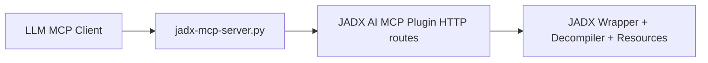

# System Architecture

## Overview

JADX-AI-MCP uses a two-hop design:

1. MCP client -> Python MCP server
2. Python MCP server -> Java plugin HTTP API inside JADX-GUI



## Runtime Layers

- **Client layer**: Claude/Codex/other MCP clients
- **MCP layer**: FastMCP tool registration (`jadx_mcp_server.py`)
- **Plugin layer**: Javalin routes under `com.zin.jadxaimcp.server.routes`
- **Decompiler layer**: JADX core + GUI state

## Transport Modes

- **Stdio mode (default)**: best for local MCP clients
  - stdout reserved for MCP frames
  - logs/banners/health output to stderr
- **HTTP mode (`--http`)**: optional streamable HTTP server

## Search and Progress

- Long-running search tools poll `/search-progress`
- Python search tooling reports progress through MCP context when supported
- Java `SearchProgressTracker` tracks states like running/completed/failed

## Caching

- Java plugin includes a decompilation cache (`DecompilationCache`)
- Exposed tools:
  - `get_cache_stats()`
  - `clear_cache()`

## Security Model

- Default bind for MCP server and plugin communication is localhost.
- Remote bind (`--host` not localhost) is unauthenticated plain HTTP.
- Python HTTP calls use `trust_env=False` to reduce proxy-side interference.

## Pagination

Many endpoints support `offset` and `count`/`limit`.  
Python side normalizes paginated responses into:

```json
{
  "type": "paginated-list",
  "items": [],
  "pagination": {
    "total": 0,
    "offset": 0,
    "limit": 0,
    "count": 0,
    "has_more": false
  }
}
```

## Source of Truth

For tool signatures and defaults, use:
- `jadx-mcp-server/jadx_mcp_server.py`
- Python tool modules in `jadx-mcp-server/src/server/tools/`
- Java route handlers in `jadx-ai/src/main/java/com/zin/jadxaimcp/server/routes/`
