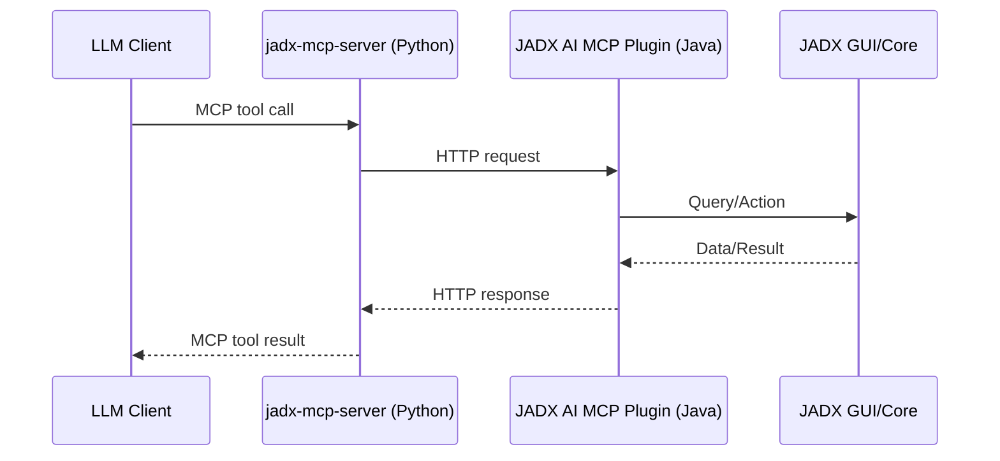

# JADX-AI-MCP Documentation

JADX-AI-MCP combines a JADX GUI plugin with a Python MCP server so LLM clients can analyze Android APKs through live JADX context.

## Components

1. **JADX-AI-MCP Plugin (Java)**  
   Embedded HTTP server inside JADX-GUI.
2. **JADX-MCP-Server (Python)**  
   FastMCP server exposing JADX operations as MCP tools.

## Architecture



## Runtime Requirements

| Component | Requirement |
|---|---|
| Java | 11+ |
| JADX | 1.5.1+ |
| Python | 3.10+ |
| UV | Latest recommended |

## Tooling Overview

Current tool categories:
- Class/navigation tools
- Search tools
- Resource tools
- Xref tools
- Refactor tools
- Debug tools
- Cache/package helpers

See complete signatures in [API Reference](api-reference.md).

## Quick Start

```bash
# Install plugin
jadx plugins --install "github:zinja-coder:jadx-ai-mcp"

# Run MCP server (stdio mode)
cd jadx-mcp-server
uv run jadx_mcp_server.py
```

Then configure your MCP client to launch the same command.

## Security Notes

- Default bind is localhost.
- If using `--host 0.0.0.0`, traffic is unauthenticated plain HTTP.
- Stdio mode keeps stdout reserved for MCP JSON-RPC (logs go to stderr).

## Next

- [Installation](installation.md)
- [User guide](user-guide.md)
- [Examples](examples.md)
- [API reference](api-reference.md)

---

**Plugin version in source (`pom.xml`)**: `6.4.0`  
**Docs update**: July 2026
